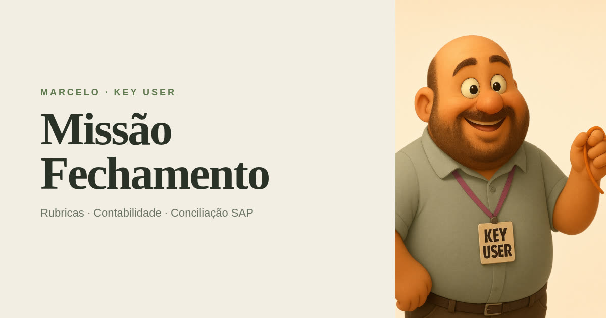

# Missão Fechamento

Jogo interativo de treinamento em conciliação SAP. O **Key User Marcelo** aparece na abertura, fala com você e reage em tempo real se a resposta demora, acerta ou erra.



## O que é

Oito fases da trilha **Rubrica → Determinação → Centro de custo → Benefício → Provisão → Tesouraria → Fechamento**. Cada fase tem história, pergunta, quatro alternativas, dica e explicação.

| Reação | Quando |
| --- | --- |
| Intro (vídeo com áudio) | Tela inicial |
| Pensando | Primeiros segundos |
| Café | Sem resposta aos 10s |
| Oh no! | Sem resposta aos 20s |
| Check verde | Resposta correta |
| ERROR | Resposta errada |

3 vidas. Sequência e bônus de tempo somam pontos. Recorde fica no navegador.

## Controles

- Toque ou teclado **A B C D** para responder
- **Enter** avança
- **H** pede dica (−20 pontos)
- **Shift+R** reinicia
- Na abertura, toque no ícone de som para ouvir o Key User

## Como rodar

```bash
git clone https://github.com/SEU-USUARIO/missao-fechamento.git
cd missao-fechamento
npm install
npm run dev
```

Abre em [http://localhost:8080](http://localhost:8080).

```bash
npm run build      # produção
npm run typecheck  # TypeScript
```

Sem login e sem banco: o placar usa `localStorage`.

## Estrutura

```
missao-fechamento/
├── public/
│   ├── avatars/          # stills do Key User (intro, thinking, coffee, anxious, correct, wrong)
│   ├── media/            # vídeos de intro e reação
│   ├── og.jpg            # capa 1200×630
│   ├── x-banner.jpg      # banner 1200×264
│   └── favicon.svg
├── src/
│   ├── routes/
│   │   ├── index.tsx     # rota / — monta o jogo
│   │   └── __root.tsx    # HTML, fontes, tema
│   ├── components/game/  # telas: start, hud, avatar, pergunta, resultado
│   ├── components/ui/    # botão e badge
│   └── lib/game/
│       ├── phases.ts     # 8 fases, gabarito, dicas
│       ├── store.ts      # estado (vidas, score, humor)
│       ├── mood.ts       # mapa still/vídeo por reação
│       └── sfx.ts        # som de acerto/erro
├── package.json
└── README.md
```

## Assets

| Arquivo | Uso |
| --- | --- |
| `public/media/intro.mp4` | Intro falada na primeira tela |
| `public/avatars/key-user.jpg` | Personagem oficial (crachá KEY USER) |
| `public/avatars/anxious.jpg` | Oh no — rosto visível |
| `public/media/correct.mp4` | Celebração |
| `public/media/wrong.mp4` | Erro / ERROR |
| `public/media/waiting.mp4` | Café (demora) |
| `public/og.jpg` | Capa do repositório e share card |

Perguntas e gabarito: [`src/lib/game/phases.ts`](src/lib/game/phases.ts).

## Stack

React 19 · TanStack Start · Tailwind v4 · Zustand · Vite

## Licença

MIT. Personagem Key User criado para este treinamento.
